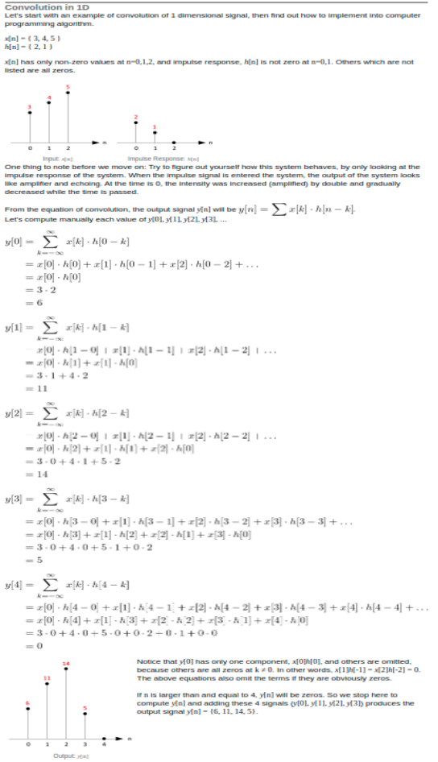
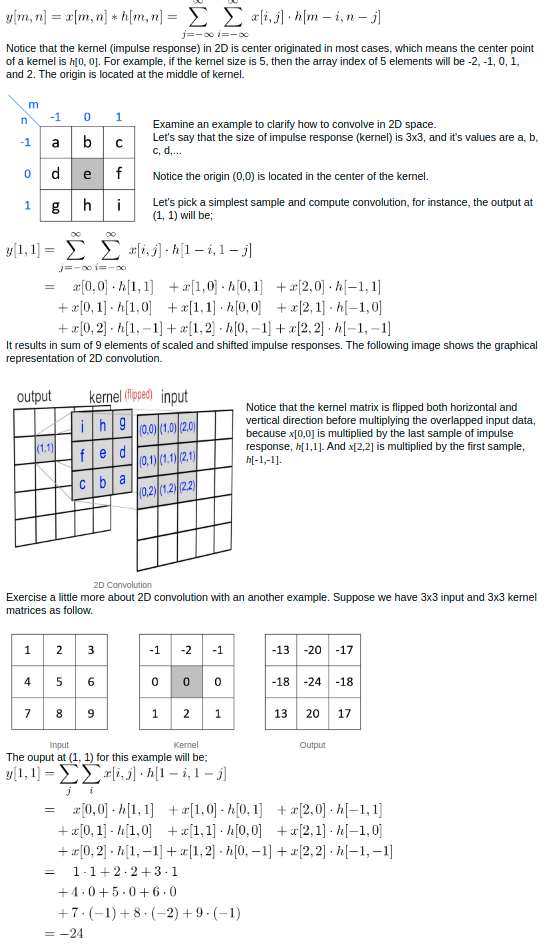

# STUDY: Convolutional Neural Network with LeNet
> **AUTHOR**: SungwookLE (joker1251@naver.com)  
> DATE: '21.4/27

### Reference
- [1] [Convolution Processing](http://www.songho.ca/dsp/convolution/convolution.html)

- [2] LENET ARCHITECTURE  

- [3] [LENET DOCUMENT](http://yann.lecun.com/exdb/lenet/)


### HOW TO EXECUTE
* Dependencies: This lab requires(Conda environment)`-`[CarND Term1 Starter Kit](https://github.com/udacity/CarND-Term1-Starter-Kit)
- (1) Number Classifier: `python LeNet_Lab_mnist.py`
- (2) Cloth Classifier: `python LeNet_Lab_fashion_mnist.py`

## [1] Covolution Basic
Convolution is fundamental concept in signal processing for various fields..
* Signal Filter: 1D Convolution
$$1D: y[n]=x[n]*h[n]= \Sigma^{inf}_{k=-inf}x[k]\cdot h[n-k]$$
1D conv is useful for analyzing the system characteristic such as differential equation. Because h[n] represents the system behavior, thus can be designed mathmatical filter using convolution.  
See the below example.  

```c++
//pseudo code
for ( i = 0; i < sampleCount; i++ ) //sample means x[n]
{
    y[i] = 0;  // set to zero before sum
    for ( j = 0; j < kernelCount; j++ ) //kernel means h[n]
    {
        y[i] += x[i - j] * h[j]; // convolve: multiply and accumulate
    }
}
```
* Image Filter: Two dimensions convolution
$$2D: y[m,n] = x[m,n]*h[m,n]=\Sigma_{j=-inf}^{inf}\Sigma_{i=-inf}^{inf}x[i,j]\cdot h[m-i, n-j]$$
2D conv is useful for image filtering such as smoothie filter(Gaussian). Adjusting the h[m,n] coefficients, the image x[m,n] can be affected to each pixel through the convolution. i.e. h[m,n] is image filter system.  
See the below example.

```c++
//pseudo code
// find center position of kernel (half of kernel size)
kCenterX = kCols / 2;
kCenterY = kRows / 2;

for(i=0; i < rows; ++i)              // rows
{
    for(j=0; j < cols; ++j)          // columns
    {
        for(m=0; m < kRows; ++m)     // kernel rows
        {
            mm = kRows - 1 - m;      // row index of flipped kernel

            for(n=0; n < kCols; ++n) // kernel columns
            {
                nn = kCols - 1 - n;  // column index of flipped kernel

                // index of input signal, used for checking boundary
                ii = i + (kCenterY - mm);
                jj = j + (kCenterX - nn);

                // ignore input samples which are out of bound
                if( ii >= 0 && ii < rows && jj >= 0 && jj < cols )
                    out[i][j] += in[ii][jj] * kernel[mm][nn];
            }
        }
    }
}
```

## [2] Convolutional Neural Network(CNN)
- Eye Perception Processing (Paper?)
- Dog --> Can be exist various kinds of picture (parameter sharing)
- Techniqcs (Dropout, Pooling, 1x1 Convolution, Inception , ... )
//size: (W-K+2P)/S

## [3] Using Tensorflow, Implementation
- tensorflow usage (session, tensor.Variable, tensor.Constant, tensor.placeholder)
- mnist dataset / fashion_mnist dataset

## Future: Keras with traffic-sign classifier, Behavior-clonning (Steering angle regression)
