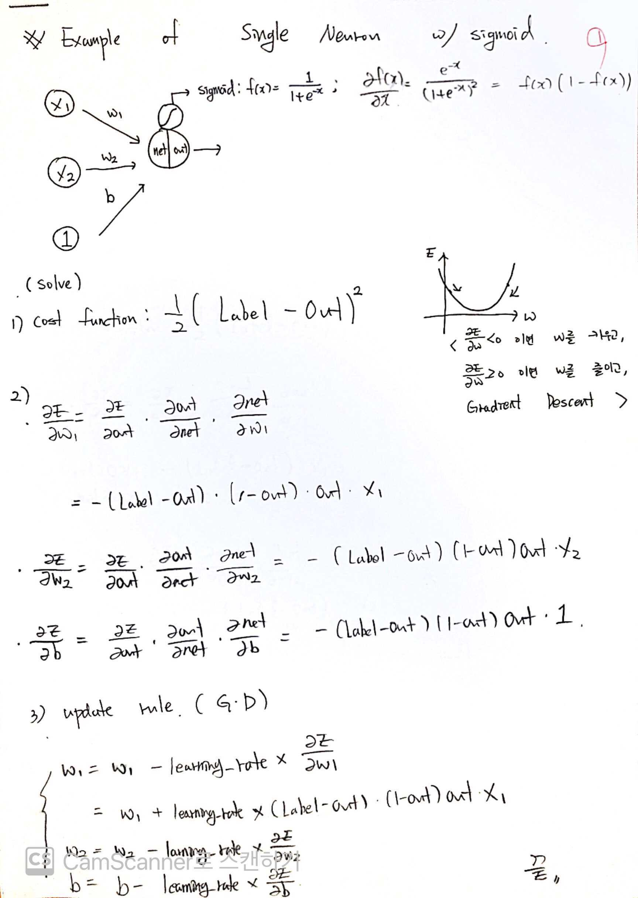
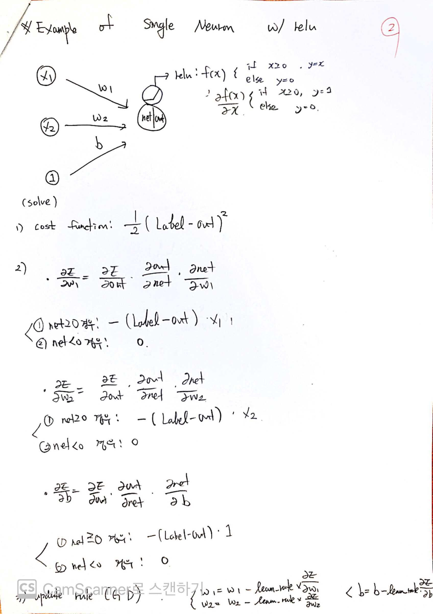
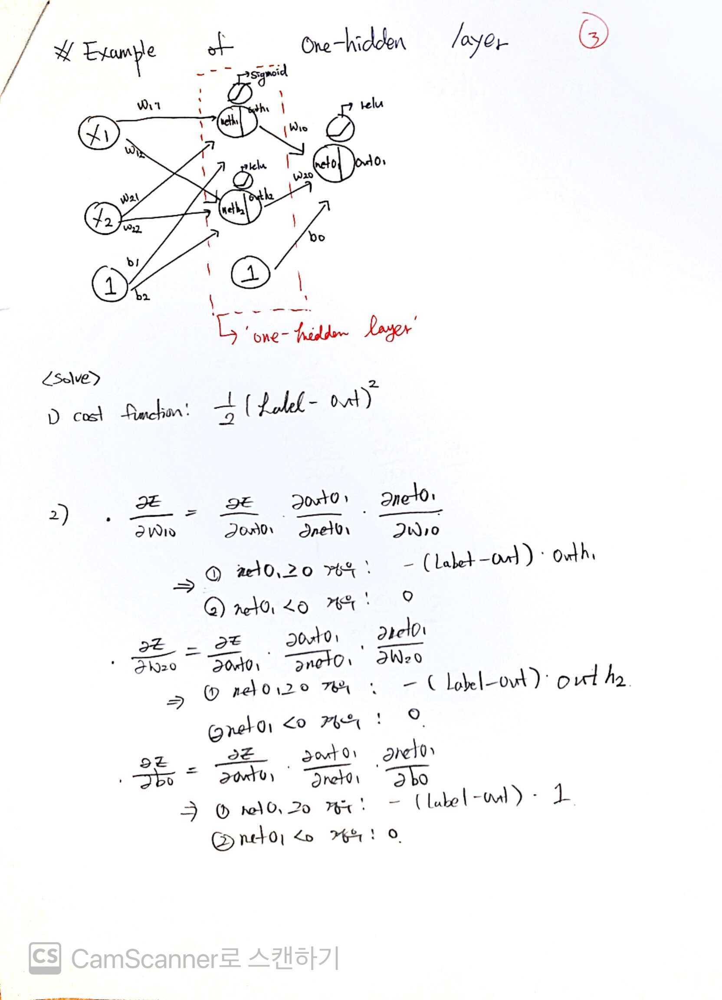
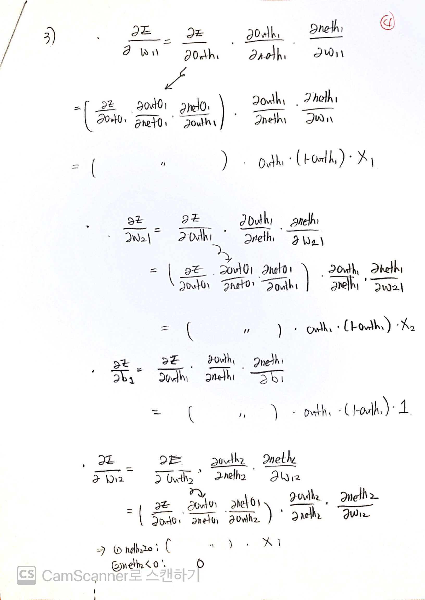
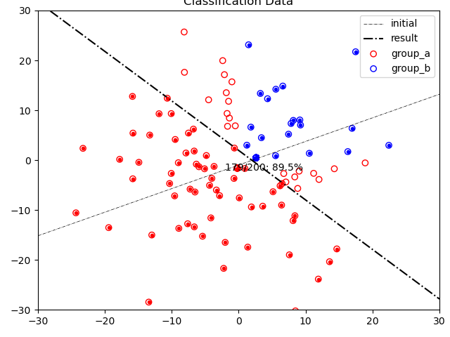
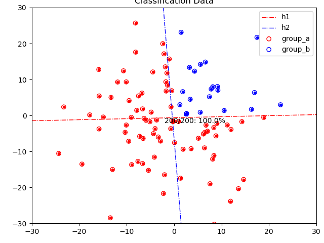

# Study of Neural-Net, Network

> **AUTHOR**: SungwookLE (joker1251@naver.com)  
> **DATE**: '21.3/17  

### Reference
* Project Explore [Github](https://github.com/SungwookLE/ReND_Car_TensorLab_with_NeuralNet)
* Machine Learning Notebook(#Theory) [Blog](https://sites.google.com/site/machinelearningnotebook2/home) 
* Deep Learning Term Database(#Theory) [Blog](http://www.aistudy.co.kr/neural/nn_definition.htm) 
* Neural Network BackPropagation1(#Practice) [Blog](https://excelsior-cjh.tistory.com/171)
* Neural Network BackPropagation2(#Practice) [Blog](https://bskyvision.com/718)

### HOW TO EXECUTE
* Data generator(csv): `python data_gen.py`
* Single Perceptron: `./single.out`
* Two Layer w/ Perceptron: `./two.out`
* Result Visualization: `python plot_result.py`

## [1] Linear Regression/Classification Problem
In the beginning, there were linear analysis methods. And those are *still useful and simple to use*, but, the linear models have limitation to increase their performance. 

* Linear Regression, [Linear_Regression](https://datalabbit.tistory.com/49)
<center></center>  

* Linear Classifier: Rogistic Regression, [Linear_Classification](https://mylearningsinaiml.wordpress.com/linear-classification/)
<center></center>  


## [2] Non-linear Regression/Classification Problem
Those method can *express the non-linearity about the data, and choose the region* though it would be divided each others with complexity.

* Nonlinear Regression, [Polynomial_Regression](https://wikidocs.net/34065)
<center></center>

* Nonlinear Classification: It can be described with `Perceptron`
<center></center>

### [2-1] Perceptron
<center></center>

* Equation of Single perceptron (Single Neuron)
$Output=f(A*inputs+B) \\
<where,\; f(x)\; is\; nonlinear\; function\; e.g.\; sigmoid,\; relu\; ...>$

Multi Perceptron Layer can describe the nonlinear classifier.
<center></center>

* Forward Propagation 
Forward Propagation is the process from input to output. At each perceptron node, output value is calculated as `input1*weight1 + input2*weight2 + ... + bias`.
<center></center>

Youtube lecture is [here.](https://youtu.be/UJwK6jAStmg)

* Backward Propagation
Using `Gradient Descent` called `G.D.`, the proper weights are calcuated step by step. 
Gradient Descent is needed the cost function value. Because, gradient descent method works see the relationship of the cost function value and weights.


The cost function (error) can be calculated the output node. From there each node's weights are calculated step by step. That's why it is called backward propagation.


Please refer below note, and BackPropagation1 [Blog](https://excelsior-cjh.tistory.com/171), BackPropagation2 [Blog](https://bskyvision.com/718).

While processing the backpropagation, middle layer neural node would be trasferred the error stimulus from the ahead of it. When calculating the amount of stimulus, the chain-rule(graph) will be helpful to get equation.  

* chain graph when `sigmoid`


* chain graph when `relu`


(#1) of 4
<center></center>

(#2) of 4
<center></center>

(#3) of 4
<center></center>

(#4) of 4
<center></center>

## [3] Practice: Equation derivation and Code

### [3-1] Single Perceptron
With two features(input), single perceptron works for classification.
This code is here: [single_layer.cpp](single_layer.cpp)
```c++
double forward_propagation(const std::vector<double> X, const std::vector<double> W, const double B, const std::string opt){
    double res;
    double ans;

    res = X.at(0)*W[0] + X.at(1)*W[1] + B;

    if (opt == "relu"){
        ans = activate_relu(res);
    }
    else if (opt == "step"){
        ans = activate_step(res);
    }
    else // (opt == "sigmoid")
    {
        ans = activate_sigmoid(res);
    }    

    return ans;
}

void backward_propagation(const double output, const double label, const std::vector<double> X, std::vector<double> &W, double &B, double learning_rate, const std::string opt){
    
    double gradient_W0, gradient_W1, gradient_B;

    if (opt=="sigmoid"){
        gradient_W0 = -(label - output)*(1 - output)*output * X[0];
        gradient_W1 = -(label - output)*(1 - output)*output * X[1];
        gradient_B =  -(label - output)*(1 - output)*output * 1;

        W[0] = W[0] - learning_rate * gradient_W0;
        W[1] = W[1] - learning_rate * gradient_W1;
        B = B - learning_rate * gradient_B;
    }
    else if (opt == "relu"){
        double net = X[0] * W[0] + X[1]*W[1] + B;
        if (net >=0){
            gradient_W0 = -(label - output) * X[0];
            gradient_W1 = -(label - output) * X[1];
            gradient_B = -(label - output) * 1;
            
            W[0] = W[0] - learning_rate * gradient_W0;
            W[1] = W[1] - learning_rate * gradient_W1;
            B = B - learning_rate * gradient_B;
        }
        else{
            W[0] = W[0];
            W[1] = W[1];
            B = B;
        }
    }

    return;
}

int main(){

    /* 0-1. Random Number Gen */
    std::random_device rd;
    std::mt19937 gen(rd());
    std::normal_distribution<double> dist(0,0.25);
    
    /* 0-2. Data Set Ready:
        DATA STRUCTURE
        {   {X1, X2, LABEL}
            {X1, X2, LABEL}
            {X1, X2, LABEL}
            ...
        }
        GROUP_A HAS LABEL '1', GROUP HAS LABEL '0'
    */
    std::vector<std::vector<double>> group_a;
    std::vector<std::vector<double>> group_b;
    read_csv("dataset.csv",group_a, group_b);
    std::vector<std::vector<double>> data_set;
    data_set.insert(data_set.end(), group_a.begin(), group_a.end());
    data_set.insert(data_set.end(), group_b.begin(), group_b.end());
    
    /* 1. Initialization of Node weights and bias */
    std::vector<double> W = {dist(gen), dist(gen)}; //weights
    double B = dist(gen); //bias
    std::cout << "Initial={\"W[0]\":" << W[0] << ", "<< "\"W[1]\":" << W[1] << ", " << "\"B\":" << B << "}"<< std::endl;

    /* 2. Learning Step with Backpropagation */
    int iteration= 500;
    double learning_rate =0.05;
    for(int iter=0; iter < iteration; ++iter){
        for(int i=0; i<data_set.size(); ++i){
            std::vector<double> res = {data_set.at(i)[0], data_set.at(i)[1]};
            //2-1. FORWARD PROPAGATION
            double out=forward_propagation(res, W, B, "sigmoid");
            //2-2. BACKWARD PROPAGATION
            backward_propagation(out, data_set.at(i)[2], res, W, B, learning_rate, "sigmoid");
        }
        // DEBUG MONITOR
        if (iter%100==0){
            /* DEBUG 1: Test with Forwardpropagation */
            std::vector<double> out_net;
            for (int i = 0; i < data_set.size(); ++i) {
                std::vector<double> res = { data_set.at(i)[0], data_set.at(i)[1] };
                double out = forward_propagation(res, W, B, "sigmoid");
                out_net.push_back(out);
            }
            /* DEBUG 2: SCORE */
            int score = 0;
            for (int i = 0; i < data_set.size(); ++i) {
                int label_est = std::round(out_net[i]);
                if (label_est == data_set[i][2])
                    score += 1;
            }
            /*DEBUG 3: PRINT */
            std::cout << iter<< "th ITERATION(" << score << "/" << out_net.size() << "): " << (double)score / out_net.size() * 100 << "%" << std::endl;
        }   
    }
    
    std::cout << "Result={\"W[0]\":" << W[0] << ", "<< "\"W[1]\":" << W[1] << ", " << "\"B\":" << B << "}"<< std::endl;
    /* 3. Test with Forwardpropagation */
    std::vector<double> out_net;
    for(int i=0; i<data_set.size(); ++i){
        std::vector<double> res = {data_set.at(i)[0], data_set.at(i)[1]};
        //3-1. FORWARD PROPAGATION
        double out=forward_propagation(res, W, B, "sigmoid");
        out_net.push_back(out);
    }
    
    /* 4. SCORE with CSV export */
    int score =0; 
    for(int i =0 ; i < data_set.size(); ++i){
        int label_est = std::round(out_net[i]);
        if (label_est == data_set[i][2])
            score+=1;
    }
    std::vector<double> label_a, label_b;
    label_a.insert(label_a.begin(), out_net.begin(), out_net.begin()+100);
    
    label_b.insert(label_b.begin(), out_net.begin()+100, out_net.end());
    save_csv("result.csv", group_a, group_b, label_a, label_b);
    std::cout << "VALIDATION(" << score << "/"<< out_net.size() << "): " << (double)score/out_net.size()*100 <<"%"<<std::endl;
    return 0;
}
```
### [3-2] Two layer(Neural Network)
This code is here: [two_layer.cpp](two_layer.cpp)

```c++
double forward_propagation(const std::vector<double> X, const std::vector<double> W, const double B, const std::string opt) {
	double res;
	double ans;

	res = X.at(0)*W[0] + X.at(1)*W[1] + B;

	if (opt == "relu") {
		ans = activate_relu(res);
	}
	else if (opt == "step") {
		ans = activate_step(res);
	}
	else // (opt == "sigmoid")
	{
		ans = activate_sigmoid(res);
	}

	return ans;
}

void backward_propagation(std::vector<double>& link_chain, int node_relation, const double output, const std::vector<double> input, std::vector<double> &W, double &B, double learning_rate, const std::string opt) {

	double gradient_W0, gradient_W1, gradient_B;
	double link_value = link_chain[node_relation];
    link_chain.clear();

	if (opt == "sigmoid") {
		gradient_W0 = link_value * (1 - output) * output * input[0];
		gradient_W1 = link_value * (1 - output) * output * input[1];
		gradient_B = link_value * (1 - output) * output * 1;

		W[0] = W[0] - learning_rate * gradient_W0;
		W[1] = W[1] - learning_rate * gradient_W1;
		B = B - learning_rate * gradient_B;

		
		link_chain.push_back(link_value * (1 - output) * output * W[0]);
		link_chain.push_back(link_value * (1 - output) * output * W[1]);

	}
	else if (opt == "relu") {
		double net = input[0] * W[0] + input[1] * W[1] + B;
		if (net >= 0) {
			gradient_W0 = link_value * input[0];
			gradient_W1 = link_value * input[1];
			gradient_B = link_value * 1;

			W[0] = W[0] - learning_rate * gradient_W0;
			W[1] = W[1] - learning_rate * gradient_W1;
			B = B - learning_rate * gradient_B;

			link_chain.push_back(link_value * W[0]);
			link_chain.push_back(link_value * W[1]);
		}
		else {
			W[0] = W[0];
			W[1] = W[1];
			B = B;

			link_chain.push_back(0);
			link_chain.push_back(0);
		}
	}

	return;
}

int main() {

	/* 0-1. Random Number Gen */
	std::random_device rd;
	std::mt19937 gen(rd());
	std::normal_distribution<double> dist(0, 0.25);

	/* 0-2. Data Set Ready:
		DATA STRUCTURE
		{   {X1, X2, LABEL}
			{X1, X2, LABEL}
			{X1, X2, LABEL}
			...
		}
		GROUP_A HAS LABEL '1', GROUP HAS LABEL '0'
	*/
	std::vector<std::vector<double>> group_a;
	std::vector<std::vector<double>> group_b;
	read_csv("dataset.csv", group_a, group_b);
	std::vector<std::vector<double>> data_set;
	data_set.insert(data_set.end(), group_a.begin(), group_a.end());
	data_set.insert(data_set.end(), group_b.begin(), group_b.end());

	/* 1. Initialization of Node weights and bias */
	std::vector<double> W_o1 = { dist(gen), dist(gen) }; //weights
	double B_o1 = dist(gen); //bias
	std::cout << "Initial={\"W_o1[0]\":" << W_o1[0] << ", " << "\"W_o1[1]\":" << W_o1[1] << ", " << "\"B_o1\":" << B_o1 << "}" << std::endl;

	std::vector<double> W_h1 = { dist(gen), dist(gen) }; //weights
	double B_h1 = dist(gen); //bias
	std::cout << "Initial={\"W_h1[0]\":" << W_h1[0] << ", " << "\"W_h1[1]\":" << W_h1[1] << ", " << "\"B_h1\":" << B_h1 << "}" << std::endl;

	std::vector<double> W_h2 = { dist(gen), dist(gen) }; //weights
	double B_h2 = dist(gen); //bias
	std::cout << "Initial={\"W_h2[0]\":" << W_h2[0] << ", " << "\"W_h2[1]\":" << W_h2[1] << ", " << "\"B_h2\":" << B_h2 << "}" << std::endl;

	/* 2. Learning Step with Backpropagation */
	int iteration = 10000;
	double learning_rate = 0.01;
	for (int iter = 0; iter < iteration; ++iter) {
		for (int i = 0; i < data_set.size(); ++i) {
			std::vector<double> res = { data_set.at(i)[0], data_set.at(i)[1] };
			//2-1. FORWARD PROPAGATION
			double out_h1 = forward_propagation(res, W_h1, B_h1, "sigmoid");
			double out_h2 = forward_propagation(res, W_h2, B_h2, "sigmoid");
			res = { out_h1, out_h2 };
			double out_o1 = forward_propagation(res, W_o1, B_o1, "sigmoid");

			//2-2. BACKWARD PROPAGATION
			std::vector<double> link_chain;
			link_chain.push_back(-(data_set.at(i)[2] - out_o1));
			std::vector<double> input;
			input= { out_h1, out_h2 };
			backward_propagation(link_chain, 0, out_o1, input, W_o1, B_o1, learning_rate, "sigmoid");
			input = { data_set.at(i)[0], data_set.at(i)[1] };
			backward_propagation(link_chain, 0, out_h1, input, W_h1, B_h1, learning_rate, "sigmoid");
			backward_propagation(link_chain, 1, out_h2, input, W_h2, B_h2, learning_rate, "sigmoid");
		}
        // DEBUG MONITOR
        if (iter%100==0){
            /* DEBUG 1: Test with Forwardpropagation */
            std::vector<double> out_net;
            for (int i = 0; i < data_set.size(); ++i) {
                std::vector<double> res = { data_set.at(i)[0], data_set.at(i)[1] };

                double out_h1 = forward_propagation(res, W_h1, B_h1, "sigmoid");
                double out_h2 = forward_propagation(res, W_h2, B_h2, "sigmoid");
                res = { out_h1, out_h2 };
                double out_o1 = forward_propagation(res, W_o1, B_o1, "sigmoid");
                out_net.push_back(out_o1);
            }

            /* DEBUG 2: SCORE */
            int score = 0;
            for (int i = 0; i < data_set.size(); ++i) {
                int label_est = std::round(out_net[i]);
                if (label_est == data_set[i][2])
                    score += 1;
            }
            /*DEBUG 3: PRINT */
            std::cout << iter<< "th ITERATION(" << score << "/" << out_net.size() << "): " << (double)score / out_net.size() * 100 << "%" << std::endl;
        }
	}

	std::cout << "Result={\"W_o1[0]\":" << W_o1[0] << ", " << "\"W_o1[1]\":" << W_o1[1] << ", " << "\"B_o1\":" << B_o1 << "}" << std::endl;
	std::cout << "Result1={\"W_h1[0]\":" << W_h1[0] << ", " << "\"W_h1[1]\":" << W_h1[1] << ", " << "\"B_h1\":" << B_h1 << "}" << std::endl;
	std::cout << "Result2={\"W_h2[0]\":" << W_h2[0] << ", " << "\"W_h2[1]\":" << W_h2[1] << ", " << "\"B_h2\":" << B_h2 << "}" << std::endl;

	/* 3. Test with Forwardpropagation */
	std::vector<double> out_net;
	for (int i = 0; i < data_set.size(); ++i) {
		std::vector<double> res = { data_set.at(i)[0], data_set.at(i)[1] };
		//3-1. FORWARD PROPAGATION
		double out_h1 = forward_propagation(res, W_h1, B_h1, "sigmoid");
		double out_h2 = forward_propagation(res, W_h2, B_h2, "sigmoid");
		res = { out_h1, out_h2 };
		double out_o1 = forward_propagation(res, W_o1, B_o1, "sigmoid");
		out_net.push_back(out_o1);
	}

	/* 4. SCORE with CSV export */
	int score = 0;
	for (int i = 0; i < data_set.size(); ++i) {
		int label_est = std::round(out_net[i]);
		if (label_est == data_set[i][2])
			score += 1;
	}
	std::vector<double> label_a, label_b;
	label_a.insert(label_a.begin(), out_net.begin(), out_net.begin() + 100);
	label_b.insert(label_b.begin(), out_net.begin() + 100, out_net.end());
	save_csv("result.csv", group_a, group_b, label_a, label_b);
	std::cout << "VALIDATION(" << score << "/" << out_net.size() << "): " << (double)score / out_net.size() * 100 << "%" << std::endl;

	return 0;
}
```

## [4] Results

### [4-1] Single_layer result
* Accuaracy: 89.5%, [result csv](result_one.csv)


### [4-2] Two_layer result
* Accuracy: 100%, [result csv](result_two.csv)


