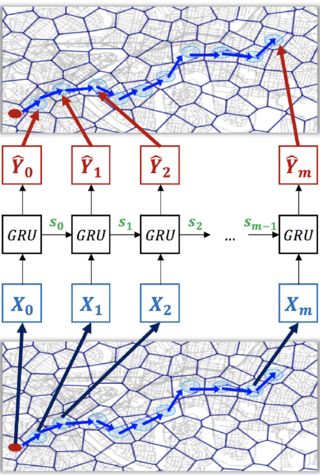

# Neuralnet Lab
> Author: SungwookLE (joker1251@naver.com)  

  

## 1. DNNs implementation (`C++`)
- Project: Divide {X,Y} Class
    - Perceptron, DNNs
    - [NOTE](./1_DNNs_implement/assets/studyNote.md.md)

## 2. CNNs framework (`Python`)
- Projcet: Divide Mnist, TrafficSign Class
    - LeNet, CNNs
    - [NOTE](./2_CNNs_frameWork/assets/studyNote.md)

## 3. RNNs implementation (`C++`)
- Project: Predict the velocity
    - One-to-One RNNs
    - [NOTE](./4_RNNs_implement/assets/studyNote.md)

## Continue ..